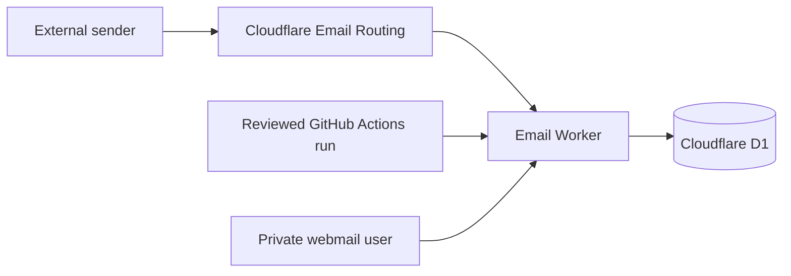

## Introduction

This guide deploys
[dreamhunter2333/cloudflare_temp_email](https://github.com/dreamhunter2333/cloudflare_temp_email)
as a private temporary-email service on Cloudflare.

It complements the project's
[official documentation](https://temp-mail-docs.awsl.uk/en/) and
[official quick start](https://temp-mail-docs.awsl.uk/en/guide/quick-start.html).
Use those pages for the complete feature reference and this post for a reviewed,
automation-oriented GitHub Actions workflow.

The workflow favors explicit, verifiable steps:

- inputs are named variables instead of hard-coded identifiers;
- commands prefer machine-readable output and explicit read-back checks;
- secrets enter through hidden prompts or standard input;
- deployments stop when the reviewed commit does not match the dispatched commit;
- destructive boundaries, especially MX changes, require human confirmation.

For every Cloudflare or GitHub mutation, the automated path appears first and the
dashboard equivalent follows. Choose one mutation path; use the other only to verify
the resulting state.

:::caution[Protect existing email before you begin]
Enabling Cloudflare Email Routing changes the domain's MX records. If the domain
already receives mail through Google Workspace, Microsoft 365, Fastmail, or another
provider, use a separate domain or prepare a tested migration and rollback plan.
:::

## Overview

The finished deployment serves the web interface and Worker from one custom domain,
stores mail in D1, and routes all incoming addresses to the Worker.



This guide uses Worker Static Assets, so only the backend workflow is required:

- enable `Deploy Backend`;
- keep `Upstream Sync` disabled during the initial deployment;
- keep `Deploy Frontend` disabled;
- keep `Deploy Frontend with page function` disabled.

The two frontend workflows are alternative split-frontend designs. They are not
extra steps for Worker Static Assets. Automatic upstream sync stays disabled until
the first deployment passes verification. The Maintenance section shows how to
enable it and trigger its first run.

### Deployment phases

| Phase      | Outcome                          | Human checkpoint           |
| ---------- | -------------------------------- | -------------------------- |
| Prepare    | Reviewed source and named inputs | Confirm account and domain |
| Provision  | D1 and private Worker config     | Confirm names and scopes   |
| Deploy     | Protected, reviewed Worker       | Create and rotate tokens   |
| Route mail | Catch-all to the Worker          | Approve MX replacement     |
| Verify     | Web, Worker, routing, and D1     | Send a safe test message   |

## Prerequisites

### Accounts and domain

You need:

- a GitHub account that can create a fork and repository secrets;
- a Cloudflare account with an active zone;
- a domain that is not carrying email you need to preserve;
- permission to create a Worker, D1 database, custom domain, and Email Routing rules.

### Deployment inputs

Decide these values before creating Cloudflare or GitHub resources:

- `ROOT_DOMAIN`: the domain that receives mail, such as `example.com`;
- `MAIL_WEB_DOMAIN`: the Webmail hostname, such as `mail.example.com`;
- `WORKER_NAME`: the deployed Worker name;
- `D1_DATABASE_NAME`: the remote database name;
- site access and administrator passwords: two different, non-empty values.

The D1 UUID is generated later. The JWT secret is generated locally immediately
before it is uploaded, so neither value needs to be prepared manually.

### Cloudflare credentials and permissions

The CLI and website paths use the same least-privilege credential plan.

#### Using the CLI

Use separate credentials for interactive setup, the routing REST call, first CI
deployment, and later CI deployments.

<!-- markdownlint-disable MD013 -->

| Credential            | Used from         | Resource scope                                       | Required access                                                                                          | Lifetime and storage                                                                                                                 |
| --------------------- | ----------------- | ---------------------------------------------------- | -------------------------------------------------------------------------------------------------------- | ------------------------------------------------------------------------------------------------------------------------------------ |
| Wrangler OAuth        | Local terminal    | Accounts and zones available to the signed-in member | OAuth scopes plus the member's Cloudflare permissions; Wrangler requests all available scopes by default | Use `--use-keyring`; run `wrangler logout` after one-time setup                                                                      |
| Routing API token     | Local REST helper | Target account and `ROOT_DOMAIN`                     | Zone Read; Email Routing Rules Write                                                                     | Store in a password manager; load only into `CF_ROUTING_API_TOKEN`; revoke after routing read-back                                   |
| CI bootstrap token    | GitHub Actions    | Target account and `ROOT_DOMAIN`                     | Workers product Admin; Zone Read; Workers Routes Write                                                   | Temporarily store as repository secret `CLOUDFLARE_API_TOKEN`; replace and revoke after the first successful steady-state deployment |
| CI steady-state token | GitHub Actions    | Existing `WORKER_NAME`                               | Editor on the selected Worker                                                                            | Store as repository secret `CLOUDFLARE_API_TOKEN` until planned rotation or revocation                                               |

<!-- markdownlint-enable MD013 -->

Wrangler OAuth persists access and refresh credentials locally. `--use-keyring`
encrypts them with a key from the operating-system keychain. The last three rows
are API tokens; never reuse one token across those roles.

Cloudflare's older token interface may show `Edit` where newer documentation uses
`Write`. The capability is the same.

The later CLI phases show where to load the routing token and how to save each CI
token as the GitHub repository secret. Wrangler OAuth remains local and is never
copied into GitHub.

#### Using the Cloudflare website UI

1. Open the Cloudflare dashboard's **API Tokens** page.
2. Select **Create Token**, then create a custom token.
3. Add the permissions for the token type listed above.
4. For the routing token, restrict **Zone Resources** to `ROOT_DOMAIN`.
5. For the bootstrap token, select **Workers product → Admin** for only the
   intended account. Add the two zone permissions for only `ROOT_DOMAIN`.
6. After the Worker exists, create the steady-state token with
   **Individual Workers → Editor** and select only `WORKER_NAME`. Do not choose
   the product-level Worker scope for this token.
7. Create each token, copy it once, and store it in a password manager.

Create the routing and bootstrap tokens initially. After the Worker exists, create
the steady-state per-Worker token, replace the GitHub repository secret, and prove
one deployment succeeds with it. Only then revoke the bootstrap token.

### Local tools

Install the reusable tools with Homebrew. The formula is named
`cloudflare-wrangler`, but it provides the `wrangler` command. Then use mise to
install Bun:

```bash
brew install gh jq mise bind cloudflare-wrangler
mise use --global bun@latest
```

- [Bun](https://bun.sh/)
- [GitHub CLI](https://cli.github.com/)
- `jq`
- `curl`
- `openssl`
- `dig` (`dnsutils` or `bind-utils` on many Linux distributions)

Verify the tools:

```bash
bun --version
wrangler --version
gh --version
jq --version
```

Authenticate GitHub and Cloudflare:

```bash
gh auth login
gh auth status

wrangler login --use-keyring
wrangler whoami
```

Wrangler's Email Routing commands may still be marked as beta. Read the local help
before relying on a flag:

```bash
wrangler email routing --help
wrangler email routing rules update --help
```

## Phase 1: Prepare the source and account

### Set session variables

Replace the example domains in your private terminal. Do not publish the edited
block.

```bash
set +x

export UPSTREAM_REPO="dreamhunter2333/cloudflare_temp_email"
export ROOT_DOMAIN="example.com"
export MAIL_WEB_DOMAIN="mail.example.com"
export WORKER_NAME="cloudflare_temp_email"
export D1_DATABASE_NAME="temp-email-db"

export GITHUB_OWNER="$(gh api user --jq .login)"
export REPOSITORY="${GITHUB_OWNER}/cloudflare_temp_email"
```

`set +x` prevents shell tracing from echoing later values. It does not repair a
secret that has already reached logs or shell history. Revoke any exposed token.

### Fork and clone the repository

For a new fork:

```bash
gh repo fork "$UPSTREAM_REPO" --clone --default-branch-only
cd cloudflare_temp_email
```

If the fork already exists:

```bash
gh repo clone "$REPOSITORY"
cd cloudflare_temp_email
git remote add upstream \
  "https://github.com/${UPSTREAM_REPO}.git" \
  2>/dev/null || true
```

#### Fork with the GitHub website

1. Open the upstream repository on GitHub.
2. Select **Fork**, choose the destination owner, and select **Create fork**.
3. On the new fork, select **Code** and copy its HTTPS URL.
4. Clone that URL with GitHub Desktop or your preferred Git client.
5. Add the upstream repository as an `upstream` remote when it is absent.

Inspect the exact source that will be deployed:

```bash
git remote -v
git status --short --branch
git show --no-patch --oneline HEAD
```

### Resolve the Cloudflare account

If Wrangler reports exactly one account, extract its ID without copying terminal
text:

```bash
export CLOUDFLARE_ACCOUNT_ID="$(
  wrangler whoami --json |
    jq -er '
      .accounts |
      if length == 1 then
        .[0].id
      else
        error("more than one account; choose explicitly")
      end
    '
)"
```

For multiple accounts, inspect the candidates and enter the intended ID privately:

```bash
wrangler whoami --json |
  jq -r '.accounts[] | [.name, .id] | @tsv'

printf 'Cloudflare Account ID: ' >&2
IFS= read -r CLOUDFLARE_ACCOUNT_ID
export CLOUDFLARE_ACCOUNT_ID
```

#### Find the Account ID in Cloudflare

1. Open the Cloudflare dashboard and select the intended account.
2. Open the account or zone **Overview** page.
3. Find **Account ID** in the account details panel and copy it privately.
4. Compare the account name with `wrangler whoami` before using the ID.

## Phase 2: Provision storage and configuration

### Create and initialize D1

Create the remote database. Change the location hint when appropriate.

```bash
wrangler d1 create "$D1_DATABASE_NAME" --location wnam
```

Resolve the database UUID from JSON:

```bash
export D1_DATABASE_ID="$(
  wrangler d1 list --json |
    jq -er --arg name "$D1_DATABASE_NAME" \
      '[.[] | select(.name == $name)] |
       if length == 1 then
         .[0].uuid
       else
         error("database name is missing or not unique")
       end'
)"
```

Apply the schema from the same reviewed commit as the Worker code:

```bash
wrangler d1 execute "$D1_DATABASE_NAME" \
  --remote \
  --file db/schema.sql \
  --yes
```

Verify that the remote tables exist:

```bash
wrangler d1 execute "$D1_DATABASE_NAME" \
  --remote \
  --command "SELECT name FROM sqlite_master WHERE type='table' ORDER BY name;" \
  --json |
  jq
```

#### Create D1 in the Cloudflare dashboard

1. Go to **Storage & Databases → D1 SQL Database**.
2. Select **Create Database**, enter `D1_DATABASE_NAME`, choose an optional location,
   and select **Create**.
3. Copy the database ID from the new database's details page.
4. Open the database's **Console** tab.
5. Paste `db/schema.sql` from the same reviewed repository commit and run it.
6. Open **Tables** or rerun the table query in **Console** to verify initialization.

Do not paste a schema copied from a different upstream revision.

### Generate a private bootstrap configuration

Create a private temporary directory that will be deleted when the shell exits:

```bash
umask 077
export PRIVATE_TMP="$(mktemp -d)"
trap 'rm -rf "$PRIVATE_TMP"' EXIT
export BACKEND_TOML_PATH="$PRIVATE_TMP/backend.toml"
```

Create the file shown above. Replace the example domain and D1 UUID with the values
resolved earlier. Address creation starts disabled so the first deployment cannot
become an open mailbox service before passwords are installed.

```toml
name = "cloudflare_temp_email"
main = "src/worker.ts"
compatibility_date = "2025-04-01"
compatibility_flags = ["nodejs_compat"]
keep_vars = true

routes = [
  { pattern = "mail.example.com", custom_domain = true }
]

[assets]
directory = "../frontend/dist/"
binding = "ASSETS"
run_worker_first = true

[triggers]
crons = ["0 0 * * *"]

[vars]
PREFIX = "tmp"
DOMAINS = ["example.com"]
DEFAULT_DOMAINS = ["example.com"]
ENABLE_USER_CREATE_EMAIL = false
ENABLE_USER_DELETE_EMAIL = true
ENABLE_ADDRESS_PASSWORD = true

[[d1_databases]]
binding = "DB"
database_name = "temp-email-db"
database_id = "<D1_DATABASE_ID>"
```

After saving the file, restrict its permissions:

```bash
chmod 600 "$BACKEND_TOML_PATH"
```

Do not put `JWT_SECRET`, `PASSWORDS`, or `ADMIN_PASSWORDS` in this file. Upload
them as Worker secrets. Do not copy the file into the repository: even without
passwords, it contains a real domain and D1 UUID.

#### Understand dashboard configuration ownership

After the Worker exists, the dashboard can add the `DB` binding under
**Settings → Bindings** and the hostname under **Settings → Domains & Routes**.
However, the next GitHub Actions deployment reconciles those settings from
`BACKEND_TOML`. Treat the TOML secret as the source of truth and use the dashboard
for verification or recovery, not as an independent long-term configuration.

## Phase 3: Deploy a protected Worker

### Create a short-lived bootstrap token

Cloudflare's current granular permission model requires Workers product-level `Admin`
to create a Worker. Updating an existing Worker can use single-Worker `Editor`.

Create a temporary bootstrap token with only:

| Scope          | Permission             | Why                                |
| -------------- | ---------------------- | ---------------------------------- |
| Target account | Workers product: Admin | Create the first Worker deployment |
| Target zone    | Workers Routes: Write  | Attach the custom domain           |
| Target zone    | Zone: Read             | Resolve the selected zone          |

It does not need DNS, Email Routing, or D1 edit access. The D1 database already
exists and is only referenced as a binding. Older token interfaces may use legacy
permission names; check the current
[Workers permissions documentation](https://developers.cloudflare.com/workers/authorization/workers/)
instead of granting all resources.

Enter the token without placing it in a command argument:

```bash
CF_CI_API_TOKEN=''
while [ -z "$CF_CI_API_TOKEN" ]; do
  printf 'Non-empty Cloudflare Bootstrap Token: ' >&2
  IFS= read -r -s CF_CI_API_TOKEN
  printf '\n' >&2
done

printf '%s' "$CF_CI_API_TOKEN" |
  gh secret set CLOUDFLARE_API_TOKEN --repo "$REPOSITORY"

unset CF_CI_API_TOKEN
```

#### Save the bootstrap token manually

1. On Cloudflare's **API Tokens** page, create the bootstrap token with the three
   scopes listed above.
2. On the GitHub fork, open **Settings → Secrets and variables → Actions**.
3. Select **New repository secret**.
4. Name it `CLOUDFLARE_API_TOKEN`, paste the token, and select **Add secret**.

### Configure GitHub Actions secrets

The backend workflow reads this repository-secret contract:

- `CLOUDFLARE_ACCOUNT_ID` (required): select the Cloudflare account;
- `CLOUDFLARE_API_TOKEN` (required): authenticate the deployment;
- `BACKEND_TOML` (required): supply the Worker configuration;
- `USE_WORKER_ASSETS` (required here): bundle Webmail into the Worker;
- `BACKEND_USE_MAIL_WASM_PARSER` (recommended): enable the WASM parser;
- `DEBUG_MODE` (optional): print detailed output when set to `true`.

`JWT_SECRET`, `PASSWORDS`, and `ADMIN_PASSWORDS` are Worker runtime secrets, not
GitHub Actions secrets. Upload them later with `wrangler secret bulk`.

```bash
printf '%s' "$CLOUDFLARE_ACCOUNT_ID" |
  gh secret set CLOUDFLARE_ACCOUNT_ID --repo "$REPOSITORY"

gh secret set BACKEND_TOML \
  --repo "$REPOSITORY" \
  < "$BACKEND_TOML_PATH"

printf '%s' 'true' |
  gh secret set USE_WORKER_ASSETS --repo "$REPOSITORY"

printf '%s' 'true' |
  gh secret set BACKEND_USE_MAIL_WASM_PARSER --repo "$REPOSITORY"

printf '%s' 'false' |
  gh secret set DEBUG_MODE --repo "$REPOSITORY"
```

#### Add repository secrets in GitHub

1. Open **Settings → Secrets and variables → Actions → Secrets** on the fork.
2. Select **New repository secret** for each name in the contract above.
3. Paste the corresponding value and select **Add secret**.
4. For `BACKEND_TOML`, paste the complete contents of the private TOML file.
5. Return to the secrets list and confirm that all six names are present.

GitHub shows secret names and update times after saving, but never reveals the values.

Keep `DEBUG_MODE=false`. A public fork's detailed Wrangler output can reveal domains,
Worker names, bindings, D1 identifiers, and deployment IDs.

Verify names and timestamps without attempting to read secret values:

```bash
gh secret list --repo "$REPOSITORY"
```

The GitHub workflow installs its own Node.js and pnpm. Neither needs a separate
manual setup step; Homebrew manages the runtime dependency of its Wrangler formula.

### Enable only the required workflow

```bash
gh workflow enable backend_deploy.yaml --repo "$REPOSITORY"
gh workflow disable sync.yaml --repo "$REPOSITORY"
gh workflow disable frontend_deploy.yaml --repo "$REPOSITORY"
gh workflow disable frontend_pagefunction_deploy.yaml --repo "$REPOSITORY"

gh workflow list --repo "$REPOSITORY" --all
```

#### Enable workflows in GitHub

1. Open the fork's **Actions** tab and enable workflows if GitHub shows the fork
   confirmation banner.
2. Select **Deploy Backend** and choose **Enable workflow** if it is disabled.
3. Open each unused frontend workflow's menu and choose **Disable workflow**.
4. Keep **Upstream Sync** disabled until the initial deployment is verified.

### Define a fail-closed deployment function

The function below refuses dirty or mismatched source, verifies the dispatched
`headSha`, and cancels the run if GitHub does not execute the reviewed commit.

```bash
deploy_reviewed_main() (
  set -euo pipefail

  local deploy_commit remote_main run_url run_id run_head
  deploy_commit="$(git rev-parse HEAD)"
  remote_main="$(gh api "repos/${REPOSITORY}/commits/main" --jq .sha)"

  git status --short --branch
  git show --no-patch --oneline "$deploy_commit"

  if [ -n "$(git status --porcelain)" ]; then
    printf 'Refusing to deploy a dirty working tree.\n' >&2
    return 1
  fi

  if [ "$deploy_commit" != "$remote_main" ]; then
    printf 'Local HEAD does not match remote main.\n' >&2
    return 1
  fi

  run_url="$(
    gh workflow run backend_deploy.yaml \
      --repo "$REPOSITORY" \
      --ref main
  )"

  if [ -z "$run_url" ]; then
    printf 'GitHub CLI did not return a workflow URL.\n' >&2
    return 1
  fi

  run_id="${run_url##*/}"
  run_head="$(
    gh run view "$run_id" \
      --repo "$REPOSITORY" \
      --json headSha \
      --jq .headSha
  )"

  if [ "$run_head" != "$deploy_commit" ]; then
    gh run cancel "$run_id" --repo "$REPOSITORY"
    printf 'Canceled run: dispatched commit did not match.\n' >&2
    return 1
  fi

  gh run watch "$run_id" \
    --repo "$REPOSITORY" \
    --compact \
    --exit-status
)
```

Run the protected bootstrap deployment:

```bash
deploy_reviewed_main
```

#### Run the initial deployment in GitHub

1. Confirm the reviewed commit is the current commit on the fork's `main` branch.
2. Open **Actions → Deploy Backend**.
3. Select **Run workflow**, choose `main`, and select **Run workflow** again.
4. Open the new run and verify its commit SHA immediately.
5. If it differs from the reviewed commit, select **Cancel workflow** and stop.
6. Only when the SHA matches, wait for every deployment step to succeed.

### Install application secrets

Use different, non-empty site and administrator passwords:

```bash
SITE_PASSWORD=''
ADMIN_PASSWORD=''

while [ -z "$SITE_PASSWORD" ]; do
  printf 'Non-empty site access password: ' >&2
  IFS= read -r -s SITE_PASSWORD
  printf '\n' >&2
done

while [ -z "$ADMIN_PASSWORD" ]; do
  printf 'Non-empty admin password: ' >&2
  IFS= read -r -s ADMIN_PASSWORD
  printf '\n' >&2
done

if [ "$SITE_PASSWORD" = "$ADMIN_PASSWORD" ]; then
  printf 'Site and admin passwords must be different.\n' >&2
else
  jq -cn \
    --arg jwt "$(openssl rand -base64 48)" \
    --arg site "$SITE_PASSWORD" \
    --arg admin "$ADMIN_PASSWORD" \
    '{
      JWT_SECRET: $jwt,
      PASSWORDS: ([$site] | tojson),
      ADMIN_PASSWORDS: ([$admin] | tojson)
    }' |
    wrangler secret bulk --name "$WORKER_NAME"
fi

unset SITE_PASSWORD ADMIN_PASSWORD
```

Verify that all three secret names exist:

```bash
wrangler secret list --name "$WORKER_NAME"
```

#### Add Worker secrets in Cloudflare

1. Generate a JWT secret locally with `openssl rand -base64 48`.
2. Go to **Workers & Pages → your Worker → Settings**.
3. Under **Variables and Secrets**, select **Add** and choose **Secret**.
4. Add `JWT_SECRET` with the generated value.
5. Add `PASSWORDS` as a JSON array string containing the site password.
6. Add `ADMIN_PASSWORDS` as a JSON array string containing the admin password.
7. Add all three changes to one version, then select **Deploy**.

Do not create these as plaintext variables.

Open `https://$MAIL_WEB_DOMAIN` in a private browser window. Confirm that no password
and an incorrect password are rejected, while the site password succeeds.

Only after that check should address creation be enabled:

```bash
awk '
  /^ENABLE_USER_CREATE_EMAIL = false$/ {
    print "ENABLE_USER_CREATE_EMAIL = true"
    next
  }
  { print }
' "$BACKEND_TOML_PATH" > "$BACKEND_TOML_PATH.next"

mv "$BACKEND_TOML_PATH.next" "$BACKEND_TOML_PATH"
chmod 600 "$BACKEND_TOML_PATH"

gh secret set BACKEND_TOML \
  --repo "$REPOSITORY" \
  < "$BACKEND_TOML_PATH"

deploy_reviewed_main
```

#### Enable address creation in GitHub

1. Change `ENABLE_USER_CREATE_EMAIL` from `false` to `true` in the retained private
   `$BACKEND_TOML_PATH` file.
2. Open **Settings → Secrets and variables → Actions → Secrets**.
3. Select `BACKEND_TOML`, then select **Update secret**.
4. Paste the complete revised TOML file and save the secret.
5. Run **Deploy Backend** using the protected SHA-check procedure above.

### Rotate to a steady-state token

Create a new token with `Editor` scoped only to the existing `$WORKER_NAME`. Because
the custom-domain connection already exists and remains unchanged, future deployments
do not need zone route write access. A later route change will fail closed.

```bash
CF_CI_API_TOKEN=''
while [ -z "$CF_CI_API_TOKEN" ]; do
  printf 'Non-empty steady-state Worker Editor token: ' >&2
  IFS= read -r -s CF_CI_API_TOKEN
  printf '\n' >&2
done

printf '%s' "$CF_CI_API_TOKEN" |
  gh secret set CLOUDFLARE_API_TOKEN --repo "$REPOSITORY"

deploy_reviewed_main
unset CF_CI_API_TOKEN
```

#### Rotate the CI token manually

1. On Cloudflare's **API Tokens** page, create a token with **Editor** access scoped
   only to the existing Worker.
2. On GitHub, open **Settings → Secrets and variables → Actions**.
3. Select `CLOUDFLARE_API_TOKEN`, choose **Update secret**, and paste the new token.
4. Run **Deploy Backend** using the protected SHA-check procedure above.
5. Return to Cloudflare's API Tokens page and revoke the bootstrap token.

For either path, do not leave the broad and narrow tokens active together.

## Phase 4: Route incoming email

### Preserve the current DNS state

The next function stores complete MX and TXT responses in a persistent private file.
It fails if either DNS query fails or returns a status other than `NOERROR`.

```bash
snapshot_email_dns() (
  set -euo pipefail

  local backup_dir stamp snapshot mx_result txt_result
  backup_dir="${XDG_STATE_HOME:-$HOME/.local/state}/cloudflare-email-routing"
  stamp="$(date -u +%Y%m%dT%H%M%SZ)"
  snapshot="$backup_dir/${ROOT_DOMAIN}-${stamp}.txt"

  mkdir -p "$backup_dir"
  chmod 700 "$backup_dir"

  mx_result="$(
    dig +noall +comments +answer MX "$ROOT_DOMAIN"
  )"
  txt_result="$(
    dig +noall +comments +answer TXT "$ROOT_DOMAIN"
  )"

  printf '%s\n' "$mx_result" | grep -q 'status: NOERROR'
  printf '%s\n' "$txt_result" | grep -q 'status: NOERROR'

  {
    printf '# Captured at %s\n' "$(date -u +%Y-%m-%dT%H:%M:%SZ)"
    printf '\n## MX\n%s\n' "$mx_result"
    printf '\n## TXT\n%s\n' "$txt_result"
  } > "$snapshot"

  chmod 600 "$snapshot"
  printf '%s\n' "$snapshot"
)

DNS_SNAPSHOT="$(snapshot_email_dns)"
export DNS_SNAPSHOT
less "$DNS_SNAPSHOT"
```

#### Snapshot DNS in Cloudflare

1. Select the zone in Cloudflare and open **DNS → Records**.
2. Record or export every existing MX record and mail-related TXT record, including
   SPF values and TTLs.
3. Save the snapshot outside the repository in a private location.
4. Identify the provider behind each MX record before changing Email Routing.

:::caution[Human confirmation: MX replacement]
If the snapshot contains MX records, identify the service behind every record. Do
not continue until losing that service is acceptable and its restoration procedure
is documented. Wrangler's `dns get` shows Cloudflare's requirements; it does not
inventory the provider currently serving your email.
:::

Read the current Email Routing state and Cloudflare's required DNS changes:

```bash
wrangler email routing settings "$ROOT_DOMAIN"
wrangler email routing dns get "$ROOT_DOMAIN"
```

### Prepare catch-all API access

Wrangler's help lists `worker` as an action type, but its catch-all validation still
rejects Worker actions. Use Cloudflare's catch-all REST endpoint with the local
routing API token instead.

Skip this API preparation when using the dashboard path in the next section.

Read the token without exposing it in command history, then resolve the target zone:

```bash
CF_ROUTING_API_TOKEN=''
while [ -z "$CF_ROUTING_API_TOKEN" ]; do
  printf 'Non-empty Cloudflare routing API token: ' >&2
  IFS= read -r -s CF_ROUTING_API_TOKEN
  printf '\n' >&2
done
export CF_ROUTING_API_TOKEN

cloudflare_auth_header() {
  printf 'Authorization: Bearer %s\n' "$CF_ROUTING_API_TOKEN"
}

export CF_ZONE_ID="$(
  curl --fail --silent --show-error --get \
    "https://api.cloudflare.com/client/v4/zones" \
    --header @<(cloudflare_auth_header) \
    --data-urlencode "name=$ROOT_DOMAIN" \
    --data-urlencode "account.id=$CLOUDFLARE_ACCOUNT_ID" |
    jq -er '
      if .success and (.result | length == 1) then
        .result[0].id
      else
        error("target zone is missing or not unique")
      end
    '
)"
```

Define update and read-back helpers. The token is passed through an anonymous file
descriptor instead of a process argument:

```bash
update_worker_catch_all() (
  set -euo pipefail

  local api_url enabled payload
  api_url="https://api.cloudflare.com/client/v4/zones"
  api_url+="/${CF_ZONE_ID}/email/routing/rules/catch_all"
  enabled="${1:?enabled must be true or false}"
  payload="$(
    jq -cn \
      --arg worker "$WORKER_NAME" \
      --argjson enabled "$enabled" \
      '{
        actions: [{type: "worker", value: [$worker]}],
        matchers: [{type: "all"}],
        enabled: $enabled,
        name: "Send catch-all to temp email Worker",
        source: "api"
      }'
  )"

  printf '%s' "$payload" |
    curl --fail --silent --show-error \
      --request PUT \
      "$api_url" \
      --header @<(cloudflare_auth_header) \
      --header 'Content-Type: application/json' \
      --data-binary @- |
    jq -e '
      if .success then
        .result
      else
        error(.errors | map(.message) | join("; "))
      end
    '
)

read_worker_catch_all() (
  local api_url="https://api.cloudflare.com/client/v4/zones"
  api_url+="/${CF_ZONE_ID}/email/routing/rules/catch_all"

  curl --fail --silent --show-error \
    "$api_url" \
    --header @<(cloudflare_auth_header) |
    jq -e '
      if .success then
        .result
      else
        error(.errors | map(.message) | join("; "))
      end
    '
)
```

### Enable routing and the Worker catch-all

```bash
wrangler email routing enable "$ROOT_DOMAIN"
update_worker_catch_all true
```

#### Configure Email Routing in Cloudflare

1. Go to **Compute → Email Service → Email Routing**.
2. Select **Onboard Domain** and choose `ROOT_DOMAIN`.
3. Review the MX and TXT records that Cloudflare will add, then select **Done**.
4. Select the domain and open **Routing Rules**.
5. Edit or enable **Catch-all rule**.
6. Set **Action** to **Send to a Worker** and select `WORKER_NAME`.
7. Set the rule to **Active** and select **Save**.

Read everything back:

```bash
wrangler email routing settings "$ROOT_DOMAIN"
wrangler email routing dns get "$ROOT_DOMAIN"
read_worker_catch_all
```

### Roll back Email Routing

To reverse the routing change, disable the catch-all before disabling Email Routing:

```bash
update_worker_catch_all false
read_worker_catch_all
wrangler email routing disable "$ROOT_DOMAIN"
```

#### Roll back routing in Cloudflare

For a provider migration without an intentional mail outage:

1. Go to **Compute → Email Service → Email Routing** and select `ROOT_DOMAIN`.
2. Under **Settings**, unlock the routing MX, SPF, and DKIM records.
3. In **DNS → Records**, add the former provider's records from the private snapshot.
4. Verify the replacement provider's required records and mail flow.
5. Return to **Routing Rules** and disable **Catch-all rule**.
6. Return to **Settings**, select **Disable Email Routing**, and confirm.
7. Verify that the replacement provider's records remain and still receive mail.

If the goal is to stop receiving mail entirely, skip steps 2–4, disable the catch-all,
then disable Email Routing.

Disabling Email Routing removes Cloudflare-managed routing records but does not
restore a previous provider. Restore its records from `$DNS_SNAPSHOT` and the saved
configuration. Never commit the snapshot or attach it to a public issue.

After the routing read-back succeeds, unset and revoke `CF_ROUTING_API_TOKEN`.
Create a new narrowly scoped token if API rollback is needed later. Dashboard
rollback does not require this token.

## Verification

### Worker deployment

```bash
wrangler deployments list \
  --name "$WORKER_NAME" \
  --json |
  jq
```

#### Verify the Worker in Cloudflare

1. Go to **Workers & Pages** and select `WORKER_NAME`.
2. Open **Deployments** and confirm the latest deployment succeeded.
3. Under **Settings → Domains & Routes**, confirm `MAIL_WEB_DOMAIN` is active.
4. Under **Settings → Bindings**, confirm the D1 binding is named `DB`.

### Web interface

```bash
curl --fail --silent --show-error \
  --output /dev/null \
  --write-out '%{http_code}\n' \
  "https://${MAIL_WEB_DOMAIN}/"
```

Expect HTTP `200`, then verify that the site password is required and create a test
address.

### Administration and database state

Open `https://$MAIL_WEB_DOMAIN/admin` and sign in as an administrator. Under
**Quick Setup → Database**, confirm the schema is healthy. Reinitialize only when
the current migration guide requires it.

### End-to-end delivery

Watch only error events in one terminal:

```bash
wrangler tail "$WORKER_NAME" \
  --format pretty \
  --status error
```

Send a non-sensitive message from an external mailbox to the test address. In another
terminal, inspect the newest D1 rows:

```bash
wrangler d1 execute "$D1_DATABASE_NAME" \
  --remote \
  --command \
  'SELECT address, created_at FROM raw_mails ORDER BY id DESC LIMIT 5;' \
  --json |
  jq
```

#### Verify delivery in Cloudflare

1. Open the Worker in **Workers & Pages**, then open its live logs or observability
   view before sending the test message.
2. Send the test message and confirm that the Worker invocation has no exception.
3. Open **Storage & Databases → D1 SQL Database → your database → Console**.
4. Run the same `SELECT` query and confirm the new address and timestamp appear.

The deployment is complete only when all of these are true:

1. The catch-all rule is enabled and targets the intended Worker.
2. The Worker error tail remains clean during the test.
3. Webmail displays the test message.
4. D1 contains the test address with a reasonable timestamp.

Do not test with real invoices, one-time passwords, resumes, recovery links, or
other sensitive mail.

## Maintenance

### Review upstream changes before deployment

Keep `Upstream Sync` disabled if every release must be reviewed. Inspect releases,
the changelog, configuration changes, and D1 migrations before merging an update:

```bash
git fetch upstream
git log --oneline HEAD..upstream/main
git diff --stat HEAD...upstream/main
git diff --name-only HEAD...upstream/main -- db
```

#### Review upstream in GitHub

1. Open the fork and select **Sync fork → Compare** instead of updating immediately.
2. Review the upstream Releases and CHANGELOG since the deployed revision.
3. Inspect changed files, especially `.github/workflows`, `db`, and Worker config.
4. Apply required D1 migrations before deploying code that depends on them.
5. Merge only the reviewed update into the fork's `main` branch.

Back up D1 before an upgrade. If upstream documents a schema migration, run the
specific reviewed migration before dispatching `Deploy Backend`. Do not replay the
full schema blindly against a production database.

### Optional: enable automatic upstream sync

The project's
[official auto-update guide](https://temp-mail-docs.awsl.uk/en/guide/actions/auto-update)
uses the `Upstream Sync` workflow. Enable it only after the initial deployment and
end-to-end verification succeed.

:::warning[Understand what auto-sync changes]
Auto-sync can merge upstream code and workflow changes into the production branch.
It does not execute D1 SQL migrations. The backend workflow also reacts when
`Upstream Sync` completes, so verify the sync and the following deployment.
Review breaking changes and apply required D1 migrations separately.
:::

The sync workflow uses `GITHUB_TOKEN` to write to the fork. Allow repository contents
write access, without allowing workflows to approve pull requests:

```bash
gh api --method PUT "repos/${REPOSITORY}/actions/permissions/workflow" \
  -f default_workflow_permissions=write \
  -F can_approve_pull_request_reviews=false
```

This setting is repository-wide. Review every enabled workflow first, then enable
the sync and backend workflows:

```bash
gh workflow enable sync.yaml --repo "$REPOSITORY"
gh workflow enable backend_deploy.yaml --repo "$REPOSITORY"
gh workflow list --repo "$REPOSITORY" --all
```

Trigger `Upstream Sync` manually the first time instead of waiting for its weekly
schedule. This confirms immediately that the permission and upstream relationship
work:

```bash
trigger_first_sync() (
  set -euo pipefail

  local run_url run_id
  run_url="$(
    gh workflow run sync.yaml \
      --repo "$REPOSITORY" \
      --ref main
  )"

  if [ -z "$run_url" ]; then
    printf 'GitHub CLI did not return a sync run URL.\n' >&2
    return 1
  fi

  run_id="${run_url##*/}"
  gh run watch "$run_id" \
    --repo "$REPOSITORY" \
    --compact \
    --exit-status
)

trigger_first_sync
```

#### Enable auto-sync in GitHub

1. Open **Settings → Actions → General** on the fork.
2. Under **Workflow permissions**, select **Read and write permissions**.
3. Leave the pull-request approval option unchecked, then select **Save**.
4. Open **Actions → Upstream Sync** and select **Enable workflow**.
5. Select **Run workflow**, choose `main`, and start the first run manually.
6. Wait for the sync to succeed, then verify the resulting **Deploy Backend** run.

After the sync succeeds, verify the sync and the triggered backend deployment:

```bash
gh run list \
  --repo "$REPOSITORY" \
  --workflow sync.yaml \
  --limit 3

gh run list \
  --repo "$REPOSITORY" \
  --workflow backend_deploy.yaml \
  --limit 3
```

Future scheduled syncs use the cron expression in `.github/workflows/sync.yaml`.
Review that file to change the interval. Disable automatic sync at any time:

```bash
gh workflow disable sync.yaml --repo "$REPOSITORY"
```

### Configure retention

The daily Cron Trigger only wakes the Worker; it does not define a retention policy.
Configure and verify cleanup in the administration interface so D1 does not grow
without limit and test mail does not remain indefinitely.

#### Configure retention manually

1. Open the Webmail administration interface and configure the cleanup policy.
2. In Cloudflare, open **Workers & Pages → your Worker → Settings**.
3. Confirm the daily Cron Trigger is present under trigger settings.
4. Recheck D1 usage after the first scheduled cleanup.

### Clean the local session

```bash
wrangler logout
unset CLOUDFLARE_ACCOUNT_ID D1_DATABASE_ID ROOT_DOMAIN MAIL_WEB_DOMAIN
unset WORKER_NAME D1_DATABASE_NAME GITHUB_OWNER REPOSITORY
unset DNS_SNAPSHOT CF_ROUTING_API_TOKEN CF_ZONE_ID
```

`wrangler logout` invalidates OAuth and removes stored credentials. The `EXIT` trap
removes the temporary Worker config but preserves the DNS rollback snapshot.

## Troubleshooting

### `Authentication error [code: 10000]`

The CI token, account ID, or resource scope does not match. Confirm that the token
belongs to the target account and that the GitHub secret has no quotes or newline.

### The custom domain returns 404

Confirm that `USE_WORKER_ASSETS` exists, `BACKEND_TOML` contains `[assets]`, and
the route uses `custom_domain = true`.

### `Catch-all rule only supports 'forward' or 'drop' action types`

Wrangler currently rejects Worker actions for catch-all rules even though its help
lists `worker`. Use the catch-all REST helpers from Phase 4 and read the rule back.

### `Cannot read properties of undefined (reading 'map')`

Open `/open_api/settings` and confirm that it returns valid JSON. This error usually
means a JSON-shaped variable is missing or malformed. Check `DOMAINS` and
`DEFAULT_DOMAINS`, then confirm the password secrets contain JSON array strings.

### `D1_ERROR: no such table`

For a new empty database, apply the schema from the exact deployed commit:

```bash
wrangler d1 execute "$D1_DATABASE_NAME" \
  --remote \
  --file db/schema.sql \
  --yes
```

For an existing database, use the specific migration documented for the upgrade.

### `D1_ERROR: Exceeded maximum DB size`

The database can no longer store mail. Remove unneeded messages and configure cleanup.
Confirm the Worker has a Cron Trigger, then review D1 limits before changing retention.

### `Upstream Sync` cannot push

Read back the repository workflow permission:

```bash
gh api "repos/${REPOSITORY}/actions/permissions/workflow"
```

`default_workflow_permissions` must be `write`. The sync workflow does not need
permission to approve pull requests.

### Mail does not arrive

```bash
wrangler email routing settings "$ROOT_DOMAIN"
wrangler email routing dns get "$ROOT_DOMAIN"
wrangler email routing rules get "$ROOT_DOMAIN" catch-all
```

Confirm that no old provider MX records remain, then inspect the Worker error tail.

## References

### Project documentation

- [cloudflare_temp_email upstream repository](https://github.com/dreamhunter2333/cloudflare_temp_email)
- [Official Temp Mail documentation](https://temp-mail-docs.awsl.uk/en/)
- [Official quick start](https://temp-mail-docs.awsl.uk/en/guide/quick-start.html)
- [Official GitHub Actions deployment guide](https://temp-mail-docs.awsl.uk/en/guide/actions/github-action)
- [Official GitHub Actions D1 guide](https://temp-mail-docs.awsl.uk/en/guide/actions/d1)
- [Official GitHub Actions auto-update guide](https://temp-mail-docs.awsl.uk/en/guide/actions/auto-update)
- [Official Worker variable reference](https://temp-mail-docs.awsl.uk/en/guide/worker-vars)
- [Official troubleshooting FAQ](https://temp-mail-docs.awsl.uk/en/guide/common-issues)

### Cloudflare platform

- [Cloudflare D1 Wrangler commands](https://developers.cloudflare.com/d1/wrangler-commands/)
- [Cloudflare Workers secrets](https://developers.cloudflare.com/workers/configuration/secrets/)
- [Cloudflare Workers permissions](https://developers.cloudflare.com/workers/authorization/workers/)
- [Cloudflare API token permissions](https://developers.cloudflare.com/fundamentals/api/reference/permissions/)
- [Cloudflare Email Routing API](https://developers.cloudflare.com/api/resources/email_routing/)
- [Cloudflare catch-all update API](https://developers.cloudflare.com/api/resources/email_routing/subresources/rules/subresources/catch_alls/methods/update/)
- [Cloudflare Email Service domain configuration](https://developers.cloudflare.com/email-service/configuration/domains/)
- [Cloudflare Email Routing rules](https://developers.cloudflare.com/email-service/configuration/email-routing-addresses/)

### GitHub Actions

- [GitHub CLI: `gh secret set`](https://cli.github.com/manual/gh_secret_set)
- [GitHub CLI: `gh workflow`](https://cli.github.com/manual/gh_workflow)
- [GitHub Actions workflow cancellation](https://docs.github.com/en/actions/how-tos/manage-workflow-runs/cancel-a-workflow-run)

### Tooling

- [Homebrew `cloudflare-wrangler` formula](https://formulae.brew.sh/formula/cloudflare-wrangler)
- [Wrangler installation](https://developers.cloudflare.com/workers/wrangler/install-and-update/)
- [Wrangler login, keyring, and logout](https://developers.cloudflare.com/workers/wrangler/commands/general/)
- [mise Bun support](https://mise.jdx.dev/lang/bun.html)
