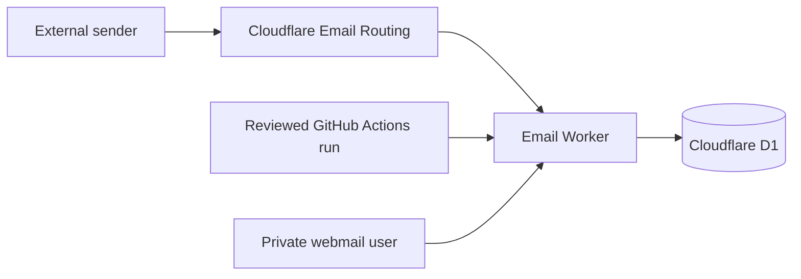

## Introduction

This guide deploys
[dreamhunter2333/cloudflare_temp_email](https://github.com/dreamhunter2333/cloudflare_temp_email)
as a private temporary-email service on Cloudflare.

It complements the project's
[official documentation](https://temp-mail-docs.awsl.uk/en/) and
[official quick start](https://temp-mail-docs.awsl.uk/en/guide/quick-start.html).
Use those pages for the complete feature reference and this post for a reviewed,
automation-oriented GitHub Actions workflow.

The workflow favors explicit, verifiable steps:

- inputs are named variables instead of hard-coded identifiers;
- commands prefer machine-readable output and explicit read-back checks;
- secrets enter through hidden prompts or standard input;
- deployments stop when the reviewed commit does not match the dispatched commit;
- destructive boundaries, especially MX changes, require human confirmation.

:::caution[Protect existing email before you begin]
Enabling Cloudflare Email Routing changes the domain's MX records. If the domain
already receives mail through Google Workspace, Microsoft 365, Fastmail, or another
provider, use a separate domain or prepare a tested migration and rollback plan.
:::

## Overview

The finished deployment serves the web interface and Worker from one custom domain,
stores mail in D1, and routes all incoming addresses to the Worker.



This guide uses Worker Static Assets, so only the backend workflow is required:

- enable `Deploy Backend`;
- keep `Upstream Sync` disabled during the initial deployment;
- keep `Deploy Frontend` disabled;
- keep `Deploy Frontend with page function` disabled.

The two frontend workflows are alternative split-frontend designs. They are not
extra steps for Worker Static Assets. Automatic upstream sync stays disabled until
the first deployment passes verification. The Maintenance section shows how to
enable it and trigger its first run.

### Deployment phases

| Phase      | Outcome                          | Human checkpoint           |
| ---------- | -------------------------------- | -------------------------- |
| Prepare    | Reviewed source and named inputs | Confirm account and domain |
| Provision  | D1 and private Worker config     | Confirm names and scopes   |
| Deploy     | Protected, reviewed Worker       | Create and rotate tokens   |
| Route mail | Catch-all to the Worker          | Approve MX replacement     |
| Verify     | Web, Worker, routing, and D1     | Send a safe test message   |

## Prerequisites

### Accounts and domain

You need:

- a GitHub account that can create a fork and repository secrets;
- a Cloudflare account with an active zone;
- a domain that is not carrying email you need to preserve;
- permission to create a Worker, D1 database, custom domain, and Email Routing rules.

### Cloudflare credentials and permissions

Keep local management and GitHub Actions credentials separate. Scope every credential
to one Cloudflare account and the target zone.

- **Local management:** first-time D1, Worker, DNS, and Email Routing setup.
  Grant D1 Write, Workers product Admin, Zone Read, DNS Write, Email Routing Rules
  Write, and Workers Routes Write.
- **GitHub bootstrap:** create the first Worker and custom domain. Grant Workers
  product Admin, Zone Read, and Workers Routes Write.
- **GitHub steady state:** deploy updates with Editor on the existing Worker.

Wrangler OAuth through `wrangler login` is preferred for interactive setup. If
automation requires a management API token, use the permissions above and keep that
token local. Never save it as the GitHub Actions token.

Cloudflare's older token interface may show `Edit` where newer documentation uses
`Write`. The capability is the same. The steady-state GitHub token does not need
D1, DNS, or Email Routing access because those resources are managed separately.

### Local tools

Install the reusable tools with Homebrew, then use mise to install Bun. Because
Homebrew has no Wrangler formula, install Wrangler globally through Bun:

```bash
brew install gh jq mise bind
mise use --global bun@latest
bun install --global wrangler
```

- [Bun](https://bun.sh/)
- [GitHub CLI](https://cli.github.com/)
- `jq`
- `curl`
- `openssl`
- `dig` (`dnsutils` or `bind-utils` on many Linux distributions)

Verify the tools:

```bash
bun --version
wrangler --version
gh --version
jq --version
```

Authenticate GitHub and Cloudflare:

```bash
gh auth login
gh auth status

wrangler login
wrangler whoami
```

Wrangler's Email Routing commands may still be marked as beta. Read the local help
before relying on a flag:

```bash
wrangler email routing --help
wrangler email routing rules update --help
```

## Phase 1: Prepare the source and account

### Set session variables

Replace the example domains in your private terminal. Do not publish the edited
block.

```bash
set +x

export UPSTREAM_REPO="dreamhunter2333/cloudflare_temp_email"
export ROOT_DOMAIN="example.com"
export MAIL_WEB_DOMAIN="mail.example.com"
export WORKER_NAME="cloudflare_temp_email"
export D1_DATABASE_NAME="temp-email-db"

export GITHUB_OWNER="$(gh api user --jq .login)"
export REPOSITORY="${GITHUB_OWNER}/cloudflare_temp_email"
```

`set +x` prevents shell tracing from echoing later values. It does not repair a
secret that has already reached logs or shell history. Revoke any exposed token.

### Fork and clone the repository

For a new fork:

```bash
gh repo fork "$UPSTREAM_REPO" --clone --default-branch-only
cd cloudflare_temp_email
```

If the fork already exists:

```bash
gh repo clone "$REPOSITORY"
cd cloudflare_temp_email
git remote add upstream \
  "https://github.com/${UPSTREAM_REPO}.git" \
  2>/dev/null || true
```

Inspect the exact source that will be deployed:

```bash
git remote -v
git status --short --branch
git show --no-patch --oneline HEAD
```

### Resolve the Cloudflare account

If Wrangler reports exactly one account, extract its ID without copying terminal
text:

```bash
export CLOUDFLARE_ACCOUNT_ID="$(
  wrangler whoami --json |
    jq -er '
      .accounts |
      if length == 1 then
        .[0].id
      else
        error("more than one account; choose explicitly")
      end
    '
)"
```

For multiple accounts, inspect the candidates and enter the intended ID privately:

```bash
wrangler whoami --json |
  jq -r '.accounts[] | [.name, .id] | @tsv'

printf 'Cloudflare Account ID: ' >&2
IFS= read -r CLOUDFLARE_ACCOUNT_ID
export CLOUDFLARE_ACCOUNT_ID
```

## Phase 2: Provision storage and configuration

### Create and initialize D1

Create the remote database. Change the location hint when appropriate.

```bash
wrangler d1 create "$D1_DATABASE_NAME" --location wnam
```

Resolve the database UUID from JSON:

```bash
export D1_DATABASE_ID="$(
  wrangler d1 list --json |
    jq -er --arg name "$D1_DATABASE_NAME" \
      '[.[] | select(.name == $name)] |
       if length == 1 then
         .[0].uuid
       else
         error("database name is missing or not unique")
       end'
)"
```

Apply the schema from the same reviewed commit as the Worker code:

```bash
wrangler d1 execute "$D1_DATABASE_NAME" \
  --remote \
  --file db/schema.sql \
  --yes
```

Verify that the remote tables exist:

```bash
wrangler d1 execute "$D1_DATABASE_NAME" \
  --remote \
  --command "SELECT name FROM sqlite_master WHERE type='table' ORDER BY name;" \
  --json |
  jq
```

### Generate a private bootstrap configuration

Create a private temporary directory that will be deleted when the shell exits:

```bash
umask 077
export PRIVATE_TMP="$(mktemp -d)"
trap 'rm -rf "$PRIVATE_TMP"' EXIT
export BACKEND_TOML_PATH="$PRIVATE_TMP/backend.toml"
```

Create the file shown above. Replace the example domain and D1 UUID with the values
resolved earlier. Address creation starts disabled so the first deployment cannot
become an open mailbox service before passwords are installed.

```toml
name = "cloudflare_temp_email"
main = "src/worker.ts"
compatibility_date = "2025-04-01"
compatibility_flags = ["nodejs_compat"]
keep_vars = true

routes = [
  { pattern = "mail.example.com", custom_domain = true }
]

[assets]
directory = "../frontend/dist/"
binding = "ASSETS"
run_worker_first = true

[triggers]
crons = ["0 0 * * *"]

[vars]
PREFIX = "tmp"
DOMAINS = ["example.com"]
DEFAULT_DOMAINS = ["example.com"]
ENABLE_USER_CREATE_EMAIL = false
ENABLE_USER_DELETE_EMAIL = true
ENABLE_ADDRESS_PASSWORD = true

[[d1_databases]]
binding = "DB"
database_name = "temp-email-db"
database_id = "<D1_DATABASE_ID>"
```

After saving the file, restrict its permissions:

```bash
chmod 600 "$BACKEND_TOML_PATH"
```

Do not put `JWT_SECRET`, `PASSWORDS`, or `ADMIN_PASSWORDS` in this file. Upload
them as Worker secrets. Do not copy the file into the repository: even without
passwords, it contains a real domain and D1 UUID.

## Phase 3: Deploy a protected Worker

### Create a short-lived bootstrap token

Cloudflare's current granular permission model requires Workers product-level `Admin`
to create a Worker. Updating an existing Worker can use single-Worker `Editor`.

Create a temporary bootstrap token with only:

| Scope          | Permission             | Why                                |
| -------------- | ---------------------- | ---------------------------------- |
| Target account | Workers product: Admin | Create the first Worker deployment |
| Target zone    | Workers Routes: Write  | Attach the custom domain           |
| Target zone    | Zone: Read             | Resolve the selected zone          |

It does not need DNS, Email Routing, or D1 edit access. The D1 database already
exists and is only referenced as a binding. Older token interfaces may use legacy
permission names; check the current
[Workers permissions documentation](https://developers.cloudflare.com/workers/authorization/workers/)
instead of granting all resources.

Enter the token without placing it in a command argument:

```bash
CF_CI_API_TOKEN=''
while [ -z "$CF_CI_API_TOKEN" ]; do
  printf 'Non-empty Cloudflare Bootstrap Token: ' >&2
  IFS= read -r -s CF_CI_API_TOKEN
  printf '\n' >&2
done

printf '%s' "$CF_CI_API_TOKEN" |
  gh secret set CLOUDFLARE_API_TOKEN --repo "$REPOSITORY"

unset CF_CI_API_TOKEN
```

### Configure GitHub Actions secrets

```bash
printf '%s' "$CLOUDFLARE_ACCOUNT_ID" |
  gh secret set CLOUDFLARE_ACCOUNT_ID --repo "$REPOSITORY"

gh secret set BACKEND_TOML \
  --repo "$REPOSITORY" \
  < "$BACKEND_TOML_PATH"

printf '%s' 'true' |
  gh secret set USE_WORKER_ASSETS --repo "$REPOSITORY"

printf '%s' 'true' |
  gh secret set BACKEND_USE_MAIL_WASM_PARSER --repo "$REPOSITORY"

printf '%s' 'false' |
  gh secret set DEBUG_MODE --repo "$REPOSITORY"
```

Keep `DEBUG_MODE=false`. A public fork's detailed Wrangler output can reveal domains,
Worker names, bindings, D1 identifiers, and deployment IDs.

Verify names and timestamps without attempting to read secret values:

```bash
gh secret list --repo "$REPOSITORY"
```

### Enable only the required workflow

```bash
gh workflow enable backend_deploy.yaml --repo "$REPOSITORY"
gh workflow disable sync.yaml --repo "$REPOSITORY"
gh workflow disable frontend_deploy.yaml --repo "$REPOSITORY"
gh workflow disable frontend_pagefunction_deploy.yaml --repo "$REPOSITORY"

gh workflow list --repo "$REPOSITORY" --all
```

### Define a fail-closed deployment function

The function below refuses dirty or mismatched source, verifies the dispatched
`headSha`, and cancels the run if GitHub does not execute the reviewed commit.

```bash
deploy_reviewed_main() (
  set -euo pipefail

  local deploy_commit remote_main run_url run_id run_head
  deploy_commit="$(git rev-parse HEAD)"
  remote_main="$(gh api "repos/${REPOSITORY}/commits/main" --jq .sha)"

  git status --short --branch
  git show --no-patch --oneline "$deploy_commit"

  if [ -n "$(git status --porcelain)" ]; then
    printf 'Refusing to deploy a dirty working tree.\n' >&2
    return 1
  fi

  if [ "$deploy_commit" != "$remote_main" ]; then
    printf 'Local HEAD does not match remote main.\n' >&2
    return 1
  fi

  run_url="$(
    gh workflow run backend_deploy.yaml \
      --repo "$REPOSITORY" \
      --ref main
  )"

  if [ -z "$run_url" ]; then
    printf 'GitHub CLI did not return a workflow URL.\n' >&2
    return 1
  fi

  run_id="${run_url##*/}"
  run_head="$(
    gh run view "$run_id" \
      --repo "$REPOSITORY" \
      --json headSha \
      --jq .headSha
  )"

  if [ "$run_head" != "$deploy_commit" ]; then
    gh run cancel "$run_id" --repo "$REPOSITORY"
    printf 'Canceled run: dispatched commit did not match.\n' >&2
    return 1
  fi

  gh run watch "$run_id" \
    --repo "$REPOSITORY" \
    --compact \
    --exit-status
)
```

Run the protected bootstrap deployment:

```bash
deploy_reviewed_main
```

### Install application secrets

Use different, non-empty site and administrator passwords:

```bash
SITE_PASSWORD=''
ADMIN_PASSWORD=''

while [ -z "$SITE_PASSWORD" ]; do
  printf 'Non-empty site access password: ' >&2
  IFS= read -r -s SITE_PASSWORD
  printf '\n' >&2
done

while [ -z "$ADMIN_PASSWORD" ]; do
  printf 'Non-empty admin password: ' >&2
  IFS= read -r -s ADMIN_PASSWORD
  printf '\n' >&2
done

if [ "$SITE_PASSWORD" = "$ADMIN_PASSWORD" ]; then
  printf 'Site and admin passwords must be different.\n' >&2
else
  jq -cn \
    --arg jwt "$(openssl rand -base64 48)" \
    --arg site "$SITE_PASSWORD" \
    --arg admin "$ADMIN_PASSWORD" \
    '{
      JWT_SECRET: $jwt,
      PASSWORDS: ([$site] | tojson),
      ADMIN_PASSWORDS: ([$admin] | tojson)
    }' |
    wrangler secret bulk --name "$WORKER_NAME"
fi

unset SITE_PASSWORD ADMIN_PASSWORD
```

Verify that all three secret names exist:

```bash
wrangler secret list --name "$WORKER_NAME"
```

Open `https://$MAIL_WEB_DOMAIN` in a private browser window. Confirm that no password
and an incorrect password are rejected, while the site password succeeds.

Only after that check should address creation be enabled:

```bash
awk '
  /^ENABLE_USER_CREATE_EMAIL = false$/ {
    print "ENABLE_USER_CREATE_EMAIL = true"
    next
  }
  { print }
' "$BACKEND_TOML_PATH" > "$BACKEND_TOML_PATH.next"

mv "$BACKEND_TOML_PATH.next" "$BACKEND_TOML_PATH"
chmod 600 "$BACKEND_TOML_PATH"

gh secret set BACKEND_TOML \
  --repo "$REPOSITORY" \
  < "$BACKEND_TOML_PATH"

deploy_reviewed_main
```

### Rotate to a steady-state token

Create a new token with `Editor` scoped only to the existing `$WORKER_NAME`. Because
the custom-domain connection already exists and remains unchanged, future deployments
do not need zone route write access. A later route change will fail closed.

```bash
CF_CI_API_TOKEN=''
while [ -z "$CF_CI_API_TOKEN" ]; do
  printf 'Non-empty steady-state Worker Editor token: ' >&2
  IFS= read -r -s CF_CI_API_TOKEN
  printf '\n' >&2
done

printf '%s' "$CF_CI_API_TOKEN" |
  gh secret set CLOUDFLARE_API_TOKEN --repo "$REPOSITORY"

deploy_reviewed_main
unset CF_CI_API_TOKEN
```

After that deployment succeeds, revoke the bootstrap token. Do not leave the broad
and narrow tokens active together.

## Phase 4: Route incoming email

### Preserve the current DNS state

The next function stores complete MX and TXT responses in a persistent private file.
It fails if either DNS query fails or returns a status other than `NOERROR`.

```bash
snapshot_email_dns() (
  set -euo pipefail

  local backup_dir stamp snapshot mx_result txt_result
  backup_dir="${XDG_STATE_HOME:-$HOME/.local/state}/cloudflare-email-routing"
  stamp="$(date -u +%Y%m%dT%H%M%SZ)"
  snapshot="$backup_dir/${ROOT_DOMAIN}-${stamp}.txt"

  mkdir -p "$backup_dir"
  chmod 700 "$backup_dir"

  mx_result="$(
    dig +noall +comments +answer MX "$ROOT_DOMAIN"
  )"
  txt_result="$(
    dig +noall +comments +answer TXT "$ROOT_DOMAIN"
  )"

  printf '%s\n' "$mx_result" | grep -q 'status: NOERROR'
  printf '%s\n' "$txt_result" | grep -q 'status: NOERROR'

  {
    printf '# Captured at %s\n' "$(date -u +%Y-%m-%dT%H:%M:%SZ)"
    printf '\n## MX\n%s\n' "$mx_result"
    printf '\n## TXT\n%s\n' "$txt_result"
  } > "$snapshot"

  chmod 600 "$snapshot"
  printf '%s\n' "$snapshot"
)

DNS_SNAPSHOT="$(snapshot_email_dns)"
export DNS_SNAPSHOT
less "$DNS_SNAPSHOT"
```

:::caution[Human confirmation: MX replacement]
If the snapshot contains MX records, identify the service behind every record. Do
not continue until losing that service is acceptable and its restoration procedure
is documented. Wrangler's `dns get` shows Cloudflare's requirements; it does not
inventory the provider currently serving your email.
:::

Read the current Email Routing state and Cloudflare's required DNS changes:

```bash
wrangler email routing settings "$ROOT_DOMAIN"
wrangler email routing dns get "$ROOT_DOMAIN"
```

### Enable routing and the Worker catch-all

```bash
wrangler email routing enable "$ROOT_DOMAIN"

wrangler email routing rules update \
  "$ROOT_DOMAIN" \
  catch-all \
  --name "Send catch-all to temp email Worker" \
  --enabled true \
  --action-type worker \
  --action-value "$WORKER_NAME"
```

Read everything back:

```bash
wrangler email routing settings "$ROOT_DOMAIN"
wrangler email routing dns get "$ROOT_DOMAIN"
wrangler email routing rules get \
  "$ROOT_DOMAIN" \
  catch-all
```

### Roll back Email Routing

To reverse the routing change, disable the catch-all before disabling Email Routing:

```bash
wrangler email routing rules update \
  "$ROOT_DOMAIN" \
  catch-all \
  --name "Disabled temp email catch-all" \
  --enabled false \
  --action-type worker \
  --action-value "$WORKER_NAME"

wrangler email routing disable "$ROOT_DOMAIN"
```

Disabling Email Routing does not restore the previous provider's MX or SPF records.
Restore them from `$DNS_SNAPSHOT` and the provider configuration saved before the
change. Never commit the snapshot or attach it to a public issue.

## Verification

### Worker deployment

```bash
wrangler deployments list \
  --name "$WORKER_NAME" \
  --json |
  jq
```

### Web interface

```bash
curl --fail --silent --show-error \
  --output /dev/null \
  --write-out '%{http_code}\n' \
  "https://${MAIL_WEB_DOMAIN}/"
```

Expect HTTP `200`, then verify that the site password is required and create a test
address.

### End-to-end delivery

Watch only error events in one terminal:

```bash
wrangler tail "$WORKER_NAME" \
  --format pretty \
  --status error
```

Send a non-sensitive message from an external mailbox to the test address. In another
terminal, inspect the newest D1 rows:

```bash
wrangler d1 execute "$D1_DATABASE_NAME" \
  --remote \
  --command \
  'SELECT address, created_at FROM raw_mails ORDER BY id DESC LIMIT 5;' \
  --json |
  jq
```

The deployment is complete only when all of these are true:

1. The catch-all rule is enabled and targets the intended Worker.
2. The Worker error tail remains clean during the test.
3. Webmail displays the test message.
4. D1 contains the test address with a reasonable timestamp.

Do not test with real invoices, one-time passwords, resumes, recovery links, or
other sensitive mail.

## Maintenance

### Review upstream changes before deployment

Keep `Upstream Sync` disabled if every release must be reviewed. Inspect releases,
the changelog, configuration changes, and D1 migrations before merging an update:

```bash
git fetch upstream
git log --oneline HEAD..upstream/main
git diff --stat HEAD...upstream/main
git diff --name-only HEAD...upstream/main -- db
```

Back up D1 before an upgrade. If upstream documents a schema migration, run the
specific reviewed migration before dispatching `Deploy Backend`. Do not replay the
full schema blindly against a production database.

### Optional: enable automatic upstream sync

The project's
[official auto-update guide](https://temp-mail-docs.awsl.uk/en/guide/actions/auto-update)
uses the `Upstream Sync` workflow. Enable it only after the initial deployment and
end-to-end verification succeed.

:::warning[Understand what auto-sync changes]
Auto-sync can merge upstream code and workflow changes into the production branch.
It does not execute D1 SQL migrations. The backend workflow also reacts when
`Upstream Sync` completes, so verify the sync and the following deployment.
Review breaking changes and apply required D1 migrations separately.
:::

The sync workflow uses `GITHUB_TOKEN` to write to the fork. Allow repository contents
write access, without allowing workflows to approve pull requests:

```bash
gh api --method PUT "repos/${REPOSITORY}/actions/permissions/workflow" \
  -f default_workflow_permissions=write \
  -F can_approve_pull_request_reviews=false
```

This setting is repository-wide. Review every enabled workflow first, then enable
the sync and backend workflows:

```bash
gh workflow enable sync.yaml --repo "$REPOSITORY"
gh workflow enable backend_deploy.yaml --repo "$REPOSITORY"
gh workflow list --repo "$REPOSITORY" --all
```

Trigger `Upstream Sync` manually the first time instead of waiting for its weekly
schedule. This confirms immediately that the permission and upstream relationship
work:

```bash
trigger_first_sync() (
  set -euo pipefail

  local run_url run_id
  run_url="$(
    gh workflow run sync.yaml \
      --repo "$REPOSITORY" \
      --ref main
  )"

  if [ -z "$run_url" ]; then
    printf 'GitHub CLI did not return a sync run URL.\n' >&2
    return 1
  fi

  run_id="${run_url##*/}"
  gh run watch "$run_id" \
    --repo "$REPOSITORY" \
    --compact \
    --exit-status
)

trigger_first_sync
```

After the sync succeeds, verify the sync and the triggered backend deployment:

```bash
gh run list \
  --repo "$REPOSITORY" \
  --workflow sync.yaml \
  --limit 3

gh run list \
  --repo "$REPOSITORY" \
  --workflow backend_deploy.yaml \
  --limit 3
```

Future scheduled syncs use the cron expression in `.github/workflows/sync.yaml`.
Review that file to change the interval. Disable automatic sync at any time:

```bash
gh workflow disable sync.yaml --repo "$REPOSITORY"
```

### Configure retention

The daily Cron Trigger only wakes the Worker; it does not define a retention policy.
Configure and verify cleanup in the administration interface so D1 does not grow
without limit and test mail does not remain indefinitely.

### Clean the local session

```bash
unset CLOUDFLARE_ACCOUNT_ID D1_DATABASE_ID ROOT_DOMAIN MAIL_WEB_DOMAIN
unset WORKER_NAME D1_DATABASE_NAME GITHUB_OWNER REPOSITORY
unset DNS_SNAPSHOT
```

The shell `EXIT` trap removes the temporary Worker configuration. It does not delete
the persistent DNS snapshot required for rollback.

## Troubleshooting

### `Authentication error [code: 10000]`

The CI token, account ID, or resource scope does not match. Confirm that the token
belongs to the target account and that the GitHub secret has no quotes or newline.

### The custom domain returns 404

Confirm that `USE_WORKER_ASSETS` exists, `BACKEND_TOML` contains `[assets]`, and
the route uses `custom_domain = true`.

### `D1_ERROR: no such table`

For a new empty database, apply the schema from the exact deployed commit:

```bash
wrangler d1 execute "$D1_DATABASE_NAME" \
  --remote \
  --file db/schema.sql \
  --yes
```

For an existing database, use the specific migration documented for the upgrade.

### Mail does not arrive

```bash
wrangler email routing settings "$ROOT_DOMAIN"
wrangler email routing dns get "$ROOT_DOMAIN"
wrangler email routing rules get "$ROOT_DOMAIN" catch-all
```

Confirm that no old provider MX records remain, then inspect the Worker error tail.

## References

### Project documentation

- [cloudflare_temp_email upstream repository](https://github.com/dreamhunter2333/cloudflare_temp_email)
- [Official Temp Mail documentation](https://temp-mail-docs.awsl.uk/en/)
- [Official quick start](https://temp-mail-docs.awsl.uk/en/guide/quick-start.html)
- [Official GitHub Actions auto-update guide](https://temp-mail-docs.awsl.uk/en/guide/actions/auto-update)

### Cloudflare platform

- [Cloudflare D1 Wrangler commands](https://developers.cloudflare.com/d1/wrangler-commands/)
- [Cloudflare Workers secrets](https://developers.cloudflare.com/workers/configuration/secrets/)
- [Cloudflare Workers permissions](https://developers.cloudflare.com/workers/authorization/workers/)
- [Cloudflare API token permissions](https://developers.cloudflare.com/fundamentals/api/reference/permissions/)
- [Cloudflare Email Routing API](https://developers.cloudflare.com/api/resources/email_routing/)
- [Cloudflare Email Routing rules](https://developers.cloudflare.com/email-service/configuration/email-routing-addresses/)

### GitHub Actions

- [GitHub CLI: `gh secret set`](https://cli.github.com/manual/gh_secret_set)
- [GitHub CLI: `gh workflow`](https://cli.github.com/manual/gh_workflow)

### Tooling

- [Wrangler installation](https://developers.cloudflare.com/workers/wrangler/install-and-update/)
- [mise Bun support](https://mise.jdx.dev/lang/bun.html)
